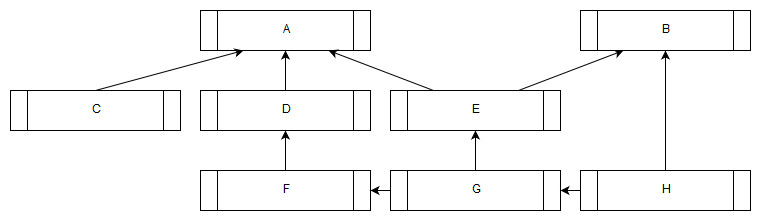

# Why?
Why would anyone spend time writing a job manager that is lock-free, fixed memory, header only, C99 compliant, has few dependencies, supports many to many dependency trees, state cloning, configurable platform bindings, custom assert handling in less than 500 lines of MIT licensed code? I mean there is already plenty of such stuff already, right? Truth is, I don't know if there are any and that is not really the point.

I have been looking at job manager implementations for quite some time and I have my own ideas on how it should be built - as all developers do. The truth is probably somewhere between that I find it fun and that I want it to work my way.

Also, I always try to limit the scope of stuff I do, there are tons of features that *could* be added and in truth, I've made multiple implementations of job managers that always tend to grow and add stuff that I thought would be useful. It always ends up being too complicated and hindering the effectiveness of the implementation and I throw away the code and take the learnings with me for the next time.

So this time I set out to just do what I would need for my hobby projects so this might not be useful for you. However, since it is small and MIT license you are free to take pieces and change it to something you want. Or you can just look at it and see a bit how I think when writing code.

# Basic principles
## Don't implement stuff that the user of the library is better suited to do
When writing libraries or code that others should build on, don't try to solve more than needed, you don't know much about the hows and whys of the code that uses your library so leave as much of the decision making to the user.

There are a couple of obvious things in this library that are left out just for that reason.

### No threading code
Although the library is built to be driven by multiple threads there is no code for creating or managing threads at all. There is just one function that your worker threads call and an (optional) callback for you to implement when new tasks are ready to execute where you can wake up threads if you have put them to sleep.

There are no rules about how many threads or how they synchronize or sleep, that is up to the library user. You may use the library with just a single thread where the library is used to execute tasks in the correct order to resolve dependencies, or you might use fibers instead of threads.

The library is thread safe but there are some limitations on what you can do with tasks once they have been marked ready for execution.

### No memory management
The user of the library is completely responsible for managing the memory both that the library uses and what the tasks use.

A job manager instance requires a certain amount of memory based on how many active tasks and active dependencies should be supported at a time, but it does not allocate the memory itself.

There are no "allocators" or calls for malloc/new/free/delete or smart pointers. The memory the job manager needs is the users' responsibility to provide, the library can answer as how much it needs to create a manager instance which allows you to specify where it should be allocated - on the heap, on the stack, a single memory allocation or allocated as part of a bigger allocation.

Each task provides a callback and a context (a void pointer) which the library user dictates what it is for and how its lifetime is managed.

Since the job manager requires all the needed memory to be allocated up front for creating and executing tasks it is possible to make a very low overhead implementation. No memory management is needed and creating a task is just one interlocked add and one (unless there is heavy contention, where it needs to try again) interlocked compare and swap. Creating dependencies is equally cheap, as is freeing tasks and dependencies.

The library user does not have pointers to data inside the job manager but instead works with IDs which is safer and uses less memory.

As an example, if you were to create a job manager that supports up to 1024 active tasks and 256 dependencies it would require around 43 kb of memory. Note though this is for 1024 *active* tasks, as soon as a task executes the task memory can be reused, the same for resolved dependencies. You can let a job manager execute an arbitrary amount of tasks, the limit is how many pending and executing tasks there is at a single point in time.

So the responsibility to create a job manager of the correct size is up to the user. The reward is a job manager that is low overhead and without dynamic memory behavior.

## Don't add "useful" features
There are a couple of features that would probably seem useful for a job manager that I have chosen to not include that has been part of other earlier iterations of my job managers.

The biggest reason for not including them is that I don't need it for my use right now - what I want/need is something that can execute a dependency graph using multiple threads efficiently.

### Priorities
The most obvious one would be priorities. I have decided to *not* add that in the library mostly because I don't need it for my use right now.

There are a couple of pretty easy ways to add it though, the most basic one would be to create one job manager for each priority level. That would work pretty good but would likely waste memory.

The other option is to use multiple "heads" of ready task queue - one for each priority level. This will add minimal memory overhead but would require some changes to the library, I have some experimental code but nothing ready for consumption yet.

If you were to add priorities you would also need to create a scheduler that has some kind of fairness to it so tasks of different priorities get executed in an orderly fashion. This can be a simple or a very complex thing to create and really not a priority for me right now.

### Cancelling of tasks
There is no way to cancel a task once it has been readied. Also, there is currently no way that you can free a task that you created without readying and executing it.
If you need to cancel a task you need to indicate for the task function callback to do nothing, it will need to be executed anyway.

I don't have a need for canceling tasks so I just avoided the complexity of it.

However, I might want to add the possibility to free a task that has not been readied to handle the case where you build a graph and for some reason do not want to actually execute it.

### Yielding of tasks
If a task wants to give some time to other tasks but execute as soon as the currently queued tasks are executed but not go into a wait state you can't do that with the library as is now.

The states of tasks are very limited which makes them easier to reason about.

A task can be created, at that time you can add dependencies to it. Once a task is ready, either through an explicit call to `ReadyTasks` or by it having all its dependencies resolved you can no longer add dependencies to it. You are not allowed to add dependencies to a task once one of the existing tasks in its dependency chain is made ready either.

The task will then be executed and the while executed you can not add new dependencies to it but you can add new tasks which in turn have dependencies, just not dependencies to the executing task or any task that is ready or have ready dependencies.

Once executed the task can return that is either complete which will free up the task or it can say that it is blocked. If it says blocked it goes back to the "created" state and will not execute until it is made ready again.

### Predictable order of non-dependant tasks
Tasks are not executed in any particular order, just because you readied task A before task B does not guarantee that task A will be executed before task B. Since the library is built to support multithreaded executing there is no guarantee of the order anyway so I have completely ignored adding any code that enforces that.

The way to achieve order is by adding dependencies (which are really cheap) or by creating a new task from inside the execution of a task and ready the new task.

### Cyclic dependency detection
There is no explicit support for detecting cyclic dependencies in the graph but there are safeguards when API usage validation is enabled.

A task will not get into ready for execution state as long as it has dependencies and if you try to ready a task that still has non-resolved dependencies you will get an error result back.

What this means is that if you build a graph that has cyclic dependencies there is no way to start the cyclic part of the graph without getting an error in return.

Of course, there is still possible to create a graph that never executes and there is no built-in code to prevent that.

### Thread local queues and job stealing
One common feature of job managers is to have thread local queues to reduce contention of the ready queue. Even though it might be useful I opted out of that for now to reduce complexity.

## A sample job graph
Let us go through how you would construct the job graph in the picture at the top of this blog post.

It consists of eight jobs with seven dependencies so we will make a shed of just that size.

### Creation and destruction of a bikeshed
There is only a function to create a job manager, no function to destructing it. This is because there is nothing to do at the destruction. If the library user has allocated the memory dynamically the memory needs, of course, to be freed but that is not done by the library.
Creating a job manager is actually very cheap so it is fully viable to create job managers on demand on the stack.

Creating a job manager on the stack:
```C
static const uint32_t MAX_TASK_COUNT = 8;
static const uint32_t MAX_DEPENDENCY_COUNT = 7;

// Reserve memory for the bikeshed on the stack
char mem[BIKESHED_SIZE(MAX_TASK_COUNT, MAX_DEPENDENCY_COUNT)];

// Create a bikeshed without any ready-state notification
// The create function can only fail if the max task count or max dependency count
// exceeds 8 388 607 in which case it returns 0.
Bikeshed shed = Bikeshed_Create(mem, MAX_TASK_COUNT, MAX_DEPENDENCY_COUNT, 0);

// Now the shed is ready to use and since we allocated the memory on the stack
// there is no need to destruct the shed.
```

Creating a job manager on the heap just a matter of allocating the memory from the heap and making sure to free it when done.
```C
static const uint32_t MAX_TASK_COUNT = 8;
static const uint32_t MAX_DEPENDENCY_COUNT = 7;

// Allocate memory for the bikeshed from the heap
void* mem = malloc(BIKESHED_SIZE(MAX_TASK_COUNT, MAX_DEPENDENCY_COUNT));
// Make sure the malloc call succeeded before calling Bikeshed_Create()

// Create the bikeshed
Bikeshed shed = Bikeshed_Create(mem, MAX_TASK_COUNT, MAX_DEPENDENCY_COUNT, 0);

// Now the shed is ready to use, the memory was allocated on the heap so it
// needs to be freed. The shed is also a pointer to the same memory address
// so we can just free that.
free(shed);
```

As we can see the library does not dictate how the memory was allocated and has no explicit destruction code.
Since it does not allocate any memory by itself there is no need for any cleanup function call.

### Creating tasks
You create one or more tasks in one go, the tasks are just created but will not execute until made ready. Each task needs a callback function and an (optional) context.
```C
struct MyJobData
{
  // data the task operates on
}

static Bikeshed_TaskResult MyJob(Bikeshed shed, Bikeshed_TaskID task_id, void* context)
{
  struct MyJobData* _this = (struct MyJobData*)context;

  // Do work with the job data here

  // We know how the data is allocated, in this sample it is on the stack so no need to free it.

  // The task is complete and the task will be freed
  return BIKESHED_TASK_RESULT_COMPLETE;
}

void DoJobs(Bikeshed shed)
{
  // The data each job uses
  MyJobData job_data[8];

  // The function for each task
  BikeShed_TaskFunc task_functions[8] =
    {
      MyJob, MyJob, MyJob, MyJob,
      MyJob, MyJob, MyJob, MyJob
    };

  // The context for each task
  void* task_contexts[8] =
    {
      &job_data[0], &job_data[1], &job_data[2], &job_data[3],
      &job_data[4], &job_data[5], &job_data[6], &job_data[7]
    }

  // The resulting task ids
  Bikeshed_TaskID task_ids[8];

  int ok = Bikeshed_CreateTasks(shed, 8, task_functions, task_contexts, task_ids);
  assert(ok);

  // The tasks have now been created and can be marked as ready for execution
  // Note that we put all our data on the stack so they all need to be
  // executed *before* we leave this function scope.
}
```
### Creating dependencies
We now have all our eight tasks and can now set up the seven dependencies. You set up dependencies by adding "children" to a task.
There is no concept of a parent type task, any task can have zero or more children which allows you to express complex graphs with one simple function.

```C
static const uint32_t TASK_A_INDEX = 0;
static const uint32_t TASK_B_INDEX = 1;
static const uint32_t TASK_C_INDEX = 2;
static const uint32_t TASK_D_INDEX = 3;
static const uint32_t TASK_E_INDEX = 4;
static const uint32_t TASK_F_INDEX = 5;
static const uint32_t TASK_G_INDEX = 6;
static const uint32_t TASK_H_INDEX = 7;

// Task 'A' is dependend on three other tasks - 'C', 'D' and 'E'
Bikeshed_TaskID task_A_dependencies[3] =
  {
    TASK_C_INDEX,
    TASK_D_INDEX,
    TASK_E_INDEX
};

ok = Bikeshed_AddDependencies(shed, task_ids[TASK_A_INDEX], 3, task_A_dependencies);
assert(ok):

// Task 'B' is dependend on two tasks - 'E' and 'H'
Bikeshed_TaskID task_B_dependencies[2] =
  {
    TASK_E_INDEX,
    TASK_H_INDEX
};

// A task can have multiple "parents" as well as multiple "children"
ok = Bikeshed_AddDependencies(shed, task_ids[TASK_B_INDEX], 2, task_B_dependencies);
assert(ok):

// If a task has just one dependency you don't need to create an array for the dependencies
ok = Bikeshed_AddDependencies(shed, task_ids[TASK_D_INDEX], 1, &task_ids[TASK_F_INDEX]);
assert(ok):

ok = Bikeshed_AddDependencies(shed, task_ids[TASK_E_INDEX], 1, &task_ids[TASK_G_INDEX]);
assert(ok):

ok = Bikeshed_AddDependencies(shed, task_ids[TASK_F_INDEX], 1, &task_ids[TASK_G_INDEX]);
assert(ok):

ok = Bikeshed_AddDependencies(shed, task_ids[TASK_G_INDEX], 1, &task_ids[TASK_H_INDEX]);
assert(ok):

```
### Readying tasks
Now we have built the entire graph that we want to execute, all we need to do is ready up the tasks that has no dependencies.

As the user of the library is the one creating the tasks and setting up the dependencies the user knows which tasks are ready to execute. There is no need for the library to try and figure that out.

```C
// Task 'C' and task 'H' has no dependencies so they can be readied.
// As tasks are executed and dependencies resolved more tasks will be readied.

Bikeshed_TaskID ready_tasks[2] =
  {
    TASK_C_INDEX,
    TASK_H_INDEX
  };

Bikeshed_ReadyTasks(shed, 2, ready_tasks);
// C and H are now ready to execute
```
### Executing tasks
There is one function that you call to execute tasks, it takes the first ready task if available and executes it. If the tasks completes it will also resolve its dependencies and ready tasks whose dependency count reaches zero as a result of the resolving.

It returns zero if there are no more tasks ready to execute. In our example we will just use the main thread to execute the tasks and once it returns zero all tasks have completed execution.

```C
while(Bikeshed_ExecuteOne(shed));
```

### Threaded execution
If you are using threaded executing each worker thread will call `Bikeshed_ExecuteOne` and you would probably want to go into an efficient wait state if it returns zero.

The library provides a callback interface when creating the shed that notifies you as the library readies tasks and from there you can wake up any sleeping workers as needed.

Example code (incomplete) to show the basic principles of threaded execution:
```C
// Define your callback and instance
struct MyWorker
{
  Bikeshed_ReadyCallback cb = { ready };
  static void ready(Bikeshed_ReadyCallback* primitive, uint32_t ready_count)
  {
    MyWorker* cb = (MyWorker*)primitive;
    wakeup_worker(cb, ready_count);
  }
  static void worker(Bikeshed shed, MyWorker* cb)
  {
    while (continue_worker(cb))
    {
      if (Bikeshed_ExecuteOne(shed))
      {
        continue;
      }
      wait_for_wakeup(cb);
    }
  }
  static int continue_worker(MyWorker* cb);
  static void wakeup_worker(MyWorker* cb, uint32_t worker_count);
  static void wait_for_wakeup(MyWorker* cb);
} myworker;

// Create the shed with the ready callback, you are responsible for keeping the callback instance alive for as long as the shed is alive.
Bikeshed shed = Bikeshed_Create(mem, MAX_TASK_COUNT, MAX_DEPENDENCY_COUNT, &mycb.cb);

// Launch your threads
thread1 = StartThread(MyWorker::worker, shed, &myworker);
thread1 = StartThread(MyWorker::worker, shed, &myworker);
thread1 = StartThread(MyWorker::worker, shed, &myworker);
thread1 = StartThread(MyWorker::worker, shed, &myworker);

// Add tasks to your shed and they will be executed by the workers

// Stop the workers
```

### Cleaning up
Well, in the non-threaded example we allocated everything on the stack so there is nothing to clean up, just return from the function and you are done.

## Cloning state
The library has one other interesting feature and that is the ability to clone a task managers state.

Imagine you have a task dependency graph that you want to run multiple times - it has the same input to the job manager and you run it for example once a frame in a game loop.

Building up the graph each time is a bit redundant and even though it is efficient to build it again it is still a bit of logic and atomic operations involved.

Since the job manager state has very few pointers internally - five - regardless of how many tasks or dependencies it has, it is very easy to clone a prepared state, execute on the clone and leaving the original intact. Next time you want to execute the same thing, just clone the state again and go.
The clone operation is basically just the cost of a memcpy of the shed memory and seven pointer offset calculations.

Of course, this only preserves the state of the job manager, any data the tasks touch when executed will not be preserved.

If we were to take our example and add state cloning to it we only need to add a few lines of code around the execution part:
```C
// Reserve memory for the cloned state - make sure to use the same task and dependency count as the original otherwise you will get memory corruption
char clone_mem[BIKESHED_SIZE(MAX_TASK_COUNT, MAX_DEPENDENCY_COUNT)];

Bikeshed cloned_shed = Bikeshed_CloneState(clone_mem, shed, sizeof(clone_mem));

// We execute the cloned_shed and the original shed is untouched
while(Bikeshed_ExecuteOne(cloned_shed));

// If we want to run the graph again we just clone and execute again:
cloned_shed = Bikeshed_CloneState(clone_mem, shed, sizeof(clone_mem));
while(Bikeshed_ExecuteOne(cloned_shed));
```

## Optional and customizable debug validation
The library has a built-in macro to validate that the API is used correctly. You have the option enable or disable it with the preprocessor directive `BIKESHED_ASSERTS`.
It is not enabled by default to provide you with the highest performing library out of the box.

The assert functionality does not really have an implementation and if you do not set the callback with `Bikeshed_SetAssert` the assert function does nothing.

If the preprocessor flag `BIKESHED_ASSERTS` is not set the entire validation logic is removed.

The validation macros are focused on validate correct API usage, not to monitor the internal state of the job manager - the intention is that the tests validate the library code and the validation macros the users' code.

## Configurable platform specific functions
The default implementation for atomic add and atomic compare and swap relies on `Windows.h` for the MSCV compiler and on clang and gcc it uses built-in compiler intrinsics.

You can override one or both of the functions by defining your own macros for `BIKESHED_ATOMICADD` and `BIKESHED_ATOMICCAS`. If you set both the dependency to `Windows.h` will be excluded.

# Thank you
Thanks for reading this far, I hope it was an interesting read.

Feel free to contact me with feedback, good or bad at my twitter account: [Dan Engelbrecht](https://twitter.com/DanEngelbrecht).

You can find the repo with all the code here: [github.com/DanEngelbrecht/bikeshed](https://github.com/DanEngelbrecht/bikeshed).

2019-04-23