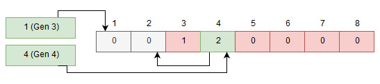
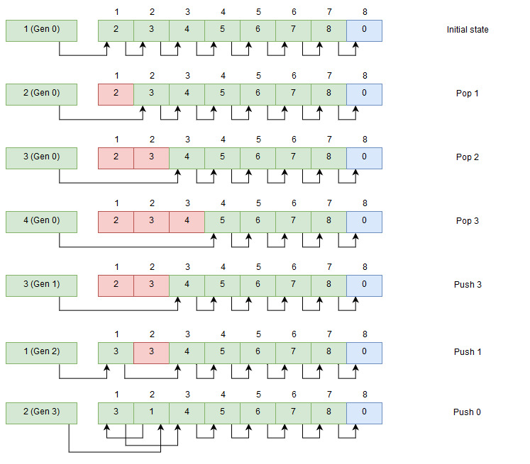
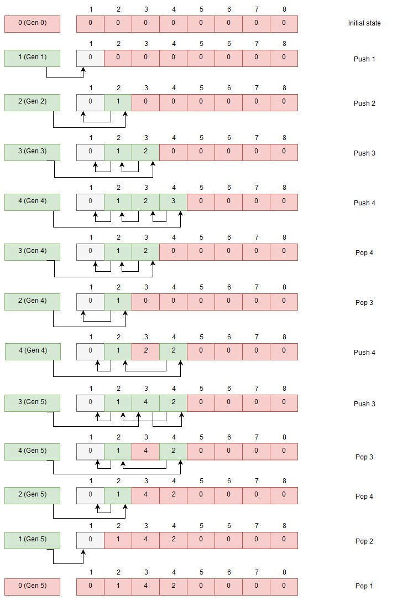
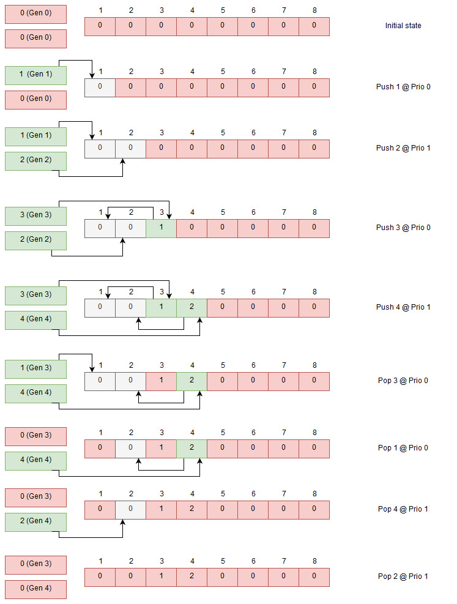

# Priorities in Bikeshed? No, channels!

## Introduction
[In a previous post](https://danengelbrecht.github.io/Bikeshed/) I talked about the design of [Bikeshed](https://github.com/DanEngelbrecht/bikeshed), the job manager I've written. I also showed a bit of how to use it.

I mentioned adding priorities to tasks and claimed that there were some "pretty easy ways to add it". So I did add support for it but under a different name - *Channels*.

Channels are a way to group tasks that are ready for execution which allows the library user to build task scheduling and priorities on top of it. They can also be used for different purposes and I will talk a bit about that as well. Since they are not only useful for priorities and there is no real built-in scheduler I decided to call it channels instead of priorities.

One important aspect of the implementation was that it should not add too much complexity to the current library nor should it add a lot of overhead - neither memory or performance should be significantly impacted.

The library source has grown by 25 lines as a result of this. Memory footprint has actually gone down by 8 bytes per instance when you use just one channel which mimics the old behavior. For each channel, you add you add 4 bytes per manager instance.

The change does not affect how much memory is used by each task or dependency - this stays the same.

Performance *is* affected but only very little, a pointer offset is added at a couple of places.

You can still have dependencies of tasks across different channels which is not something you could easily do if you use the other option I mentioned - one manager per priority level.

All in all, it feels like a worthwhile addition even if I personally don't need this feature right now.

## How does it really work
First I thought I'd dive in a bit on how the library manages tasks, dependencies and ready queues in a bit more detail. This will help you understand how the library works and also why adding channels was a very cheap thing to do.

The library manages instances of tasks and dependencies using an index pool which builds on the library [AtomicIndexPool](https://github.com/DanEngelbrecht/AtomicIndexPool) which I wrote. Index pools are nothing new and something you probably already have in your toolbox.

Bikeshed uses an array of pre-allocated tasks - structs that contain the data about the task such as the function pointer to use and the context data. To allocate tasks from this array it uses "index pools".

Index pool is a structure that keeps track of which indexes in the array is used instead of having an array of data which you add and remove from. The index pool is also pre-allocated to the same size as the task array.

The index pool can be used in more than one way - if you start with a pre-filled array you can use it to allocate stuff by popping of the first free index. You can also start with an empty index pool which you push indexes onto. Such a pool can be used to store ready to consume items. This is what Bikeshed does, it has two index pools for allocating tasks and dependency references and one pool to queue ready tasks.

The index pools are laid out so that each entry in the index pool points to the next free index up until there are no more free indexes. Bikeshed uses indexes that start at one and uses zero as a sentinel value to indicate that there are no more entries available.

By using indexes and pre-allocated arrays there is no need to allocate memory dynamically but it also means that you don't have to deal with dangling pointers. You can always be safe in reading data out of the array using the index without worrying about pointing to uninitialized or already freed memory.

Each index pool also has a "head" entry that is just a 32-bit value. The head is used as an atomic value where we swap in a new head, the head points to the first available index. Pushing a new index is done by looking at the head value, store that at the new index entry and do a compare-and-swap to set the head to the new entry. Popping values you need to look at the head, follow where it points and takes that next index and do a compare and swap with the head, freeing up the index at the head.

Now, this seems nice and simple but as probably many of you know you need to watch out for the  [ABA problem](https://en.wikipedia.org/wiki/ABA_problem). I use a generation counter that I mix into the head value to make it unique enough to avoid the problem.

Let's take a look at how it looks it works with a filled index pool - this is what I use to allocate tasks.

### Allocating indexes

At the top, we see that the head hold "1" together with the generation marker "0". Each time an index is pushed to the index pool the generation is increased, this makes the head value always unique even if we push back the same index later on. This is essential when we use multithreaded code so only one thread will succeed in swapping out the head value.

The ready queue uses the same data structure but it starts out empty, the indexes to push are the indexes that we get when allocating tasks indexes. The index pool for allocation and for the ready queue has the same size so we can just use the indexes as is.

### Queueing indexes

When pushing we increase the generation counter with an atomic add, we read the head value, set the index entry we want to push to the current head and then do a compare and swap with our pushed index merged with the generation. If another thread is faster and gets in between we try again by updating our index entry with the new head value. We keep trying until it succeeds.

When popping from the index pool we need to get the head value and get the generation from that. We look where the head is pointing and get value at that index. That value is merged with the generation we got and we try to swap in our new calculated head. If it fails we need to read the head value and try again.

By only changing the head and not traversing any deep data structure the pushing and popping to index pools are very cheap.

This is how it works with one channel for the ready queue but extending so we have multiple channels for the ready queue is actually quite simple, we just create more "heads". As we allocate indexes from a single pool we use the same index array so there is no risk for conflict.

### Dual queuing indexes

This supports an arbitrary number of heads - when we want to pop an index we need to check all the heads so it is not entirely without a performance cost, but checking one channel is a cheap as before.

Each such head is called a *channel* in bikeshed and you can assign a channel to each task - this must be done before you ready the tasks as it will determine which queue head it ends up in. When you execute tasks you specify which channel you want to check.

## Uses for channels
The channels feature started out as a way to support priorities and it can still be used for that, but it really lets the user of the library decide what to do with them.

### Priorities
Add one channel for each priority level - say you have three levels, "Low", "Normal" and "High". When you execute a task you would first try with the "High" channel and if that is empty you try the "Normal" channel, and finally "Low" if the "Normal" channel is empty. If a ready queue is empty it is very cheap to check - basically just a read of a 32-bit value.

The scheduling logic is up to the user of the library to write and there is much work done regarding this to get a fair scheduler. One more reason for me not to try to write one for you.

### Task grouping
There might be other reasons to group tasks other than on priority. A certain category of tasks that you only want to execute one at a time, for this you can create a special channel that is polled by a single task and have other channels where multiple threads work. You can still have dependencies between tasks of different channels.

Some mobile processors even have cores that have different performance characteristics and you could use the channel feature to schedule certain kind of task to specific threads/cores.

### Work stealing
You can also use the channels to set up one ready queue per thread with a preferred channel for each thread. New work for a thread is queued on the preferred channel and work to be done is first taken from this channel. If there is no work ready to execute it can scan the other channels for work to do and steal those.

## Caveats
All is not nice and rosy of course as all data is tightly packed and task and dependency memory is shared between the threads there will cache eviction between cores when accessing data. In particular, all the ready queue heads are located next to each other in memory so even if they won't fight for the same 32 bits of memory they will still fight for the same cache line which is not ideal.

I have some ideas on how to at least allow to move each ready head to a separate cache line but at the same time, I don't want to waste a lot of memory on padding. We'll see what I can come up with.

## Conclusion
Adding channels to support priorities was fairly easy using the channel concept and the API opens up for the library user to decide how to write a custom scheduling logic.

Memory usage did not increase, performance impact was minimal and code complexity did not increase significantly.

I'm pretty happy with how it turned out and I hope you find it useful.
