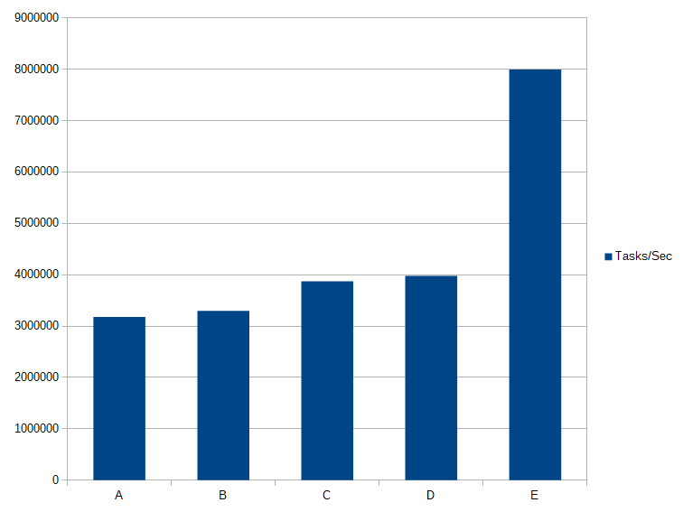
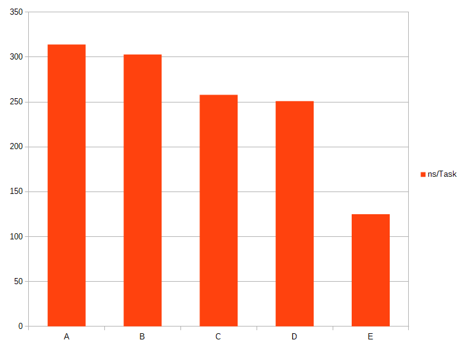

# Analysis of performance improvements in Bikeshed

## Background
The last couple of releases of Bikeshed has added a few features that increase the performance of creating, executing and disposing of tasks. I have assumed that the improvements are good and only done small tests to validate that it is true but not really done any comparison with real numbers.

Improvements that have been added since the initial pre-release include:
- Channels
- Cache alignment of ready-heads
- CPU Yield on contention
- Batching of operations - Task creation/deletion and dependency creation/deletion

All the changes are worth investigation if and by how much they improve the performance of Bikeshed, if they don't provide a benefit they should be removed.

The improvements are not for free - the code is slightly more complex and has grown quite a bit since the first pre-release but the header still lands below 1000 lines - and that includes information, comments, version history, and license.

## The test
The test consists of four (4) threads producing tasks and making them ready as fast as possible only pulling back when it creates tasks faster than tasks are consumed. Four (4) consuming threads that try to execute ready tasks as fast as they can.

Each producer thread creates tasks for a specific channel - if only one channel is enabled they all produce tasks to the same channel. When there are more channels each thread produces tasks to its own channel.

Each consumer thread consumes tasks from a preferred channel - if the channel has no tasks ready for consumption it tries to look at the other channels and tries to steal work from there. If only one channel is enabled all threads try to get tasks from that single channel.

Each task workload consists of adding one (1) to an atomic counter, this ensures that what we measure is as much as possible how Bikeshed performs.

The tests are performed on my laptop which has an Intel Core i7-6700HQ running at 2.6 GHz with 4 physical cores and hyperthreading enabled, running 64 bit Windows Home 10.0.17763.

I'm compiling with MSVC version 19.20.27508.1 with /O2.

## Test variants

### Test A
- 4 producers
- 4 consumers
- 1 channel
- No cache alignment
- No CPU Yield
- No Batch Task Creation

This test is designed to be as close as possible to the first release of Bikeshed where there was no support for channels, no cache alignment option, no CPU yield and no task batch creation optimizations.

All producers and consumers work on the same channel which means heavy contention on the single ready head.

### Test B
- 4 producers
- 4 consumers
- 4 channel
- No cache alignment
- No CPU Yield
- No Batch Task Creation

The first feature enabled is the channel feature, which should alleviate some of the pressure on the ready heads. As there is no padding/cache alignment between each ready head they still fight for the same cache line.

### Test C
- 4 producers
- 4 consumers
- 4 channel
- Cache alignment
- No CPU Yield
- No Batch Task Creation

Adding alignment/padding between each ready head should reduce contention on each ready head as they now reside on separate cache lines.

### Test D
- 4 producers
- 4 consumers
- 4 channel
- Cache alignment
- CPU Yield
- No Batch Task Creation

When CAS operations fail, for example when pushing or popping indexes to the ready heads a CPU yield instruction is executed as a back-off strategy.

### Test E
- 4 producers
- 4 consumers
- 4 channel
- Cache alignment
- CPU Yield
- Batch Task Creation (16 tasks)

Last we enable batching, the API for creating and readying more than one task at a time was present in the first version of the API but for each individual task, there was one CAS operation. The latest code builds up the chain of tasks first and does only one CAS operation when creating or readying multiple tasks.

## Results

### Test A
4 producers, 4 consumers, 1 channel, No cache alignment, No CPU Yield, No Batch Task Creation

This is the baseline results:

*tasks/second* **3180886**

*ns/task* **314**

### Test B
4 producers, 4 consumers, 4 channel, No cache alignment, No CPU Yield, No Batch Task Creation

Introducing channels and task stealing:

*tasks/second* **3295478**

*ns/task* **303**

### Test C
4 producers, 4 consumers, 4 channel, Cache alignment, No CPU Yield, No Batch Task Creation

Aligning each ready-head on a cache line boundary:

*tasks/second* **3871440**

*ns/task* **258**

### Test D
4 producers, 4 consumers, 4 channel, Cache alignment, CPU Yield, No Batch Task Creation

Yield CPU when failing CAS operation:

*tasks/second* **3979132**

*ns/task* **251**

### Test E
4 producers, 4 consumers, 4 channel, Cache alignment, CPU Yield, Batch Task Creation

Create tasks in batches:

*tasks/second* **7995729**

*ns/task* **125**

### Results Table

| Test | Tasks per second | Time per task |
|-------|--------|---------|
| A | 3180886 | 314 ns |
| B | 3295478 | 303 ns |
| C | 3871440 | 258 ns |
| D | 3979132 | 251 ns |
| E | 7995729 | 125 ns |

### Results Graph

#### Tasks / Second

#### Time / Task

## Conclusion
All the improvements have value in increasing the performance of Bikeshed, the largest jump is batching which is natural. Channels, cache alignment, CPU Yield and batching all boils down to reducing the pressure on the highly contested atomic data and batching is the most effective way of doing that.

I don't know how Bikeshed compares to other similar libraries - it would be interesting to try and do some analysis of that too, but it also comes down to what features you want/need and what kind of API is suitable for you.
